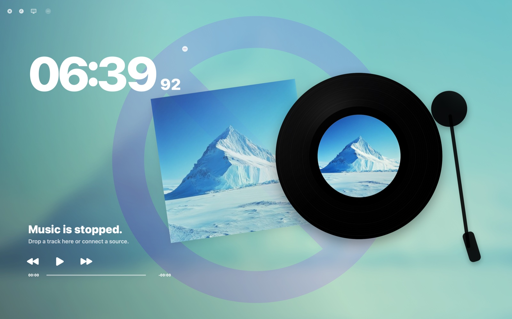

<div align="center">

# ⊙ VinylPod

**A liquid-glass now-playing widget for your Mac.**

Synced lyrics for anything you play — even in the browser. No accounts. No API keys.

[](../../releases/latest)
[](#quick-start)
[](Package.swift)
[](Package.swift)
[](LICENSE)

[**⬇ Download**](../../releases/latest) · [Quick start](#quick-start) · [How it works](#how-it-works) · [Build from source](#build-from-source)

<br>



<sub>*Desktop mode — rendered by the app itself, no mockup. The landscape is the soul; the UI is a whisper of glass on top of it.*</sub>

</div>

<br>

## Why VinylPod

- **It sees what you're playing — without your passwords.** A tiny bundled browser extension mirrors any tab's Media Session (YouTube, Spotify Web, YouTube Music, Apple Music web…) into a native widget over a **loopback-only** WebSocket. Nothing ever leaves your Mac.
- **Synced lyrics, keyless.** Live auto-scrolling lyrics from [LRCLIB](https://lrclib.net) — free, no API key, no sign-up, cached offline.
- **Five sizes and a Dynamic Island.** From a 162-pt glass tile to a full ambient desktop scene (⌘1–⌘5). Float it above your windows — or *behind* them, like a living wallpaper.
- **Album-aware glass.** The widget tints its glassmorphism from the album art's color palette, and the GroovePulse visualizer breathes with each song's tempo.
- **Native and weightless.** Pure Swift + SwiftUI, zero third-party dependencies, a single 30 fps render clock that pauses when idle.

## Quick start

1. **[Download the latest release](../../releases/latest)**, unzip, and drag `VinylPod.app` to Applications.
   First launch: **right-click → Open** (the app is ad-hoc signed, not notarized yet).
   Look for the **⊙ disc icon** in your menu bar.
2. **Play a local file** — drag any audio file onto the widget. Album art, palette tint and lyrics appear on their own.
3. **Or capture your browser** — in Chrome / Edge / Brave open `chrome://extensions`, enable *Developer mode*, choose *Load unpacked*, and select the `BrowserExtension/` folder from the download. Then just play something in a tab.
4. **Resize the vibe** — ⌘1–⌘5 or the menu-bar picker: Small · Medium · Regular · Large · Desktop, plus a Dynamic Island.

## How it works

```
Browser tab ── content script ──► MV3 service worker ── ws://127.0.0.1:8787 ─┐
Local file  ─────────────────────► AVFoundation player ──────────────────────┤
                                                                             ▼
                                          NowPlayingService (single source of truth)
                                                             │
                    ┌───────────────┬────────────────────────┼──────────────┐
                    ▼               ▼                        ▼              ▼
             palette extraction   glass widgets       synced lyrics    transport relay
             (album-art tint)     (5 sizes + Island)  (LRCLIB, .lrc)   (play/pause/skip)
```

The bridge is deliberately paranoid: loopback-only bind, 256 KB frame cap, 6-connection cap, SSRF-guarded artwork fetches. Your listening never touches a third-party server — the only outbound request is the optional lyrics lookup.

## Build from source

Command Line Tools are enough — no Xcode needed:

```bash
git clone https://github.com/jerryhsieh991-lang/VinylPod.git
cd VinylPod
./make_app.sh release      # swift build + bundle → dist/VinylPod.app
open dist/VinylPod.app
```

> Toolchain note: the macOS 26+ SDK makes SwiftUI `@State` a macro whose plugin ships only with Xcode; the code uses `typealias VPState = SwiftUI.State` (`@VPState`) so it builds under plain Command Line Tools.

## Roadmap

- Native Spotify / Apple Music connect (seams in place, needs OAuth + entitlements)
- Last.fm scrobbling (wired, awaiting real API keys + Keychain storage)
- Notarized builds & a Homebrew cask
- More landscape packs — the ice mountain is only the first soul

## For developers

The engineering docs live in the repo root: [`codex.md`](codex.md) (living project map) · [`architecture.md`](architecture.md) · [`CONTRACTS.md`](CONTRACTS.md) (frozen module seams) · [`design_system.md`](design_system.md) (design tokens) · [`PRD.md`](PRD.md) · [`SECURITY.md`](SECURITY.md).

## License

[MIT](LICENSE) © 2026 jerryhsieh991-lang
