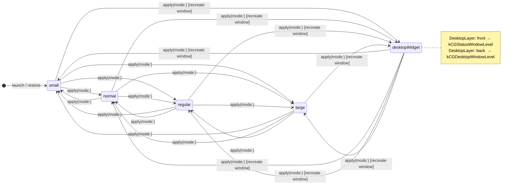
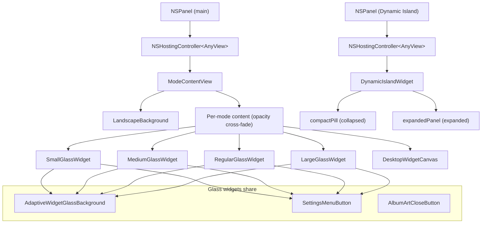

# 02 — Windowing & UI / Liquid-Glass Design System

VinylPod is a macOS menu-bar companion. Its windowing model is intentionally minimal: one reusable `NSPanel` hosts all floating card modes; a separate panel handles the Dynamic Island. The UI is rendered entirely in SwiftUI and styled with an album-reactive liquid-glass system whose colors derive from the current track's artwork in real time.

---

## 1. Hosting Model

### NSPanel + NSHostingController

All on-screen panels are `NSPanel` instances configured as borderless, non-activating floating windows:

```
styleMask: [.borderless, .nonactivatingPanel]
panel.isOpaque = false
panel.backgroundColor = .clear
panel.becomesKeyOnlyIfNeeded = true
panel.hidesOnDeactivate = false
```

The transparent, chrome-free window lets SwiftUI content own all visual chrome — rounded corners, glass blur, drop shadows — without any AppKit frame interference. `becomesKeyOnlyIfNeeded` prevents the panel from stealing key-window status from the user's active app.

SwiftUI content is hosted via `NSHostingController<AnyView>`. The controller is created once and reused across mode switches; only `rootView` is swapped:

```swift
if let controller = hostingController {
    controller.rootView = view        // reuse — no teardown
} else {
    let controller = NSHostingController(rootView: view)
    window.contentView = controller.view
}
```

This avoids the cost of tearing down and rebuilding the NSView hierarchy on every mode change.

### Two-Panel Architecture

| Panel | Purpose | Level |
|-------|---------|-------|
| Main panel | Hosts the active widget mode (small/normal/regular/large/desktop) | `.floating` (non-widget) or CGWindowLevel from `kCGStatusWindowLevel`/`kCGDesktopWindowLevel` (widget) |
| Dynamic Island panel | Pinned top-center notch companion; always above other windows | `kCGStatusWindowLevel` |

The two panels are independently positioned and never share a hosting controller.

---

## 2. Window Modes

Five modes defined in `WindowMode` (Sources/VinylPod/Core/Models.swift):

| Mode | `displayName` | `defaultSize` | Panel style |
|------|--------------|---------------|-------------|
| `.small` | Small | 162 × 162 | Non-widget: shadow, floating level, movable |
| `.normal` | Medium | 344 × 132 | Non-widget |
| `.regular` | Regular | 300 × 360 | Non-widget |
| `.large` | Large | 320 × 432 | Non-widget |
| `.desktopWidget` | Desktop | screen frame at runtime | Widget: no shadow, `stationary`, `ignoresCycle`, not movable |

Keyboard shortcuts: `⌘1`…`⌘5` (one per mode, `.shortcutKey`).

### Style Classes

Modes divide into two **style classes** based on `NSWindow` properties:

- **Non-widget** (`small`, `normal`, `regular`, `large`): shadow enabled, `level = .floating`, `isMovableByWindowBackground = true`.
- **Widget** (`desktopWidget`): no shadow, non-movable, `collectionBehavior = [.stationary, .ignoresCycle]`, window level driven by `DesktopLayer`.

Crossing this boundary requires creating a new `NSWindow` because the style mask and shadow configuration cannot be changed on an existing window without side effects.

---

## 3. Mode State Machine



### `apply(mode:)` Decision Tree

```
apply(mode: newMode)
├─ same mode? → refresh stacking / sync Dynamic Island, return
├─ modeTransitionInFlight == newMode? → guard (debounce), return
├─ styleClassChanged(from: currentMode, to: newMode)?
│   └─ YES → recreateWindow(for: newMode)     [widget ↔ non-widget boundary]
└─ NO → sizeAndPosition + hostContent + applyStacking
```

`modeTransitionInFlight` is a guard that prevents rapid taps from firing the expensive glass-tree path multiple times within one run-loop tick.

### `recreateWindow(for:)`

1. Nil out `hostingController` and `window`.
2. Build a fresh `NSPanel` via `makeWindow(for:)`.
3. `sizeAndPosition` → `hostContent` → `makeKeyAndOrderFront`.
4. `old?.orderOut(nil)` then `old?.close()` — the new window is visible before the old one disappears, avoiding a blank-screen flash.
5. Audio/playback is never touched; only the hosting shell changes.

---

## 4. Sizing and Positioning

### Non-Widget Modes

**Resize around center**: when a mode switch happens while the window is visible, the new frame is computed by anchoring to `current.midX / current.midY`:

```swift
origin = NSPoint(x: current.midX - size.width / 2,
                 y: current.midY - size.height / 2)
```

This makes the card grow and shrink in place rather than from a corner.

**On-screen clamping**: after computing the target frame, `clamp(_:to:)` keeps the entire frame inside `window.screen?.visibleFrame`. This guards against the new (larger) frame pushing under the menu bar, the notch, or off the display edge after a size upgrade.

**Persistence**: the window origin is stored in `UserDefaults` under `"vinylWindowOrigin"`. On restore, the saved value is validated — it must not be `.zero` and the candidate rect must intersect a real screen — before being re-clamped to the current visible frame.

**Widget mode**: ignores all of the above; always expands to `NSScreen.main?.frame` (the full display).

### Dynamic Island Panel

Separate sizing logic in `dynamicIslandFrame(expanded:)`:

| State | Size |
|-------|------|
| Collapsed | 390 × 30 — a pill at the top of the screen |
| Expanded | 430 × 700 — a tall glass card below the notch |

Expansion is animated with `NSAnimationContext` (0.30s, ease-in-out). The SwiftUI content inside the panel animates independently with a spring (`response: 0.38, damping: 0.84`).

---

## 5. Size-Switch Rendering Strategy

### The Anti-Jank Pattern

The key design decision is **never animating the NSWindow frame** when switching between non-widget modes. Heavy NSVisualEffectView blur layers produce visible drag and lag when the frame animates — the blur samples the screen region as the frame moves, producing a shimmer/stretch artifact.

Instead:

1. `sizeAndPosition` sets the new frame **synchronously** (`setFrame(:display:)` with no animation).
2. `hostContent` swaps `rootView` on the existing controller immediately after.
3. SwiftUI handles the visual transition inside the view tree with a pure opacity cross-fade.

### Stable Shell Identity

`ModeContentView.body` is tagged:

```swift
.id("vinylpod.content")
```

This single stable ID tells SwiftUI to reuse the entire hosting view tree across mode changes rather than tearing it down. Without it, the `LandscapeBackground` and glass `NSVisualEffectView` layers would be rebuilt on every switch, causing a momentary blank before the new layout appears.

### Inner Opacity Cross-Fade

Inside `ModeContentView`, only the per-mode `content` block transitions:

```swift
content
    .transition(.opacity)
    .animation(VPTheme.fade, value: mode)         // 0.45s ease-in-out
    .animation(VPTheme.fade, value: nowPlaying.track)
    .animation(VPTheme.fade, value: nowPlaying.isPlaying)
```

The `LandscapeBackground` behind it never transitions — it is always present and stable.

### Popover Cleanup

Before a mode switch, `closeTransientPopoverWindows()` iterates `NSApp.windows` and closes any window whose class name contains `"popover"`. SwiftUI popovers are hosted in private transient windows; if the source view is replaced while a popover is open, those windows survive for a frame and steal clicks, making the switch appear to lag.

---

## 6. View Hierarchy



---

## 7. Liquid-Glass Design System

### VPTheme Tokens (Sources/VinylPod/Core/Theme.swift)

| Token | Value | Purpose |
|-------|-------|---------|
| `textPrimary` | `white` | Track title, primary labels |
| `textSecondary` | `white @ 0.65` | Artist, secondary copy |
| `textMuted` | `white @ 0.40` | Empty state, captions |
| `scrim` | `black @ 0.35` | Legibility layer over landscape |
| `glassTint` | `white @ 0.07` | Base glass fill tint |
| `glassStroke` | `white @ 0.18` | Border on glass panels |
| `panel` | `white @ 0.08` | Source chip, pill backgrounds |
| `radius` | 14pt | Standard corner radius |
| `radiusSmall` | 10pt | Menus, small chips |
| `radiusLarge` | 22pt | Window corners, overlay panels |
| `fade` | `easeInOut(0.45s)` | Track changes, mode switches |
| `liquid` | `easeInOut(1.05s)` | Album palette cross-fade |
| `spring` | `spring(response: 0.32, damping: 0.7)` | Pop interactions |

`@VPState` is a `typealias` for `SwiftUI.State` that avoids the Xcode-only `@State` macro plugin, required because the project builds under Command Line Tools.

### Album Color Palette Flow

```
Track artwork (NSImage)
        │
        ▼
ArtworkColorExtractor.paletteOffMain(from:)
  • CIAreaAverage → dominant (stable background mood)
  • Pixel scan @ 52×52 → vibrant (saturation-weighted), muted (midtone-weighted)
  • dominantMood = dominant.mixed(vibrant, 0.24).adjusted(...)
  • shadow = dominantMood.darkened(0.68)
        │
        ▼ (published to main actor)
AppSettings.albumPalette: AlbumColorPalette
  ├─ dominant: RGBColorToken   — glass membrane base
  ├─ vibrant:  RGBColorToken   — rim highlights, bloom, stroke tint
  ├─ muted:    RGBColorToken   — glass frost, soft fill
  └─ shadow:   RGBColorToken   — depth under glass
        │
        ├─▶ LandscapeBackground   → linear + radial overlays (.overlay blend)
        ├─▶ AdaptiveWidgetGlassBackground → 6-layer glass stack
        ├─▶ DesktopWidgetCanvas → full-screen gradient wash
        └─▶ SettingsMenu dropdown → vibrant tint @ 0.11 (multiply blend)
```

`AlbumColorPalette.iceMountain` is the cold-blue fallback used before any artwork loads.

Animations on `settings.albumPalette` use `VPTheme.liquid` (1.05s) so color transitions are cinematic rather than abrupt.

### AdaptiveWidgetGlassBackground Layer Stack

`AdaptiveWidgetGlassBackground` (Sources/VinylPod/Views/Widget/AdaptiveWidgetGlassBackground.swift) is the core glass primitive used by Small, Medium, Regular, and Large widgets. Six layers compose in order:

| Layer | What it does |
|-------|-------------|
| 1. `VisualEffectBlur(.hudWindow, .behindWindow)` | The actual frosted-glass translucency; everything above is deliberately thin to keep it breathing |
| 2. Album color membrane | Linear gradient (vibrant → dominant → shadow), normal blend; makes the glass visibly inherit the cover hue |
| 3. Light frost | Top-weighted neutral wash; replaces flat white fills that turned glass milky |
| 4. Text-safety vignette | Thin multiply-blended black gradient; preserves white text contrast without killing the hue |
| 5. Album-color bloom | Radial gradient from upper-left, soft-light blend; tints rather than paints |
| 6. Specular "wet edge" | Linear gradient (top-rim white → vibrant → clear), screen blend; the crisp highlight that lifts glass off the landscape |
| 6b. Corner highlight | Radial at (0.10, 0.08), screen blend; adds a glass-ball specular point |
| Optional: bottom shade | Darkens the lower zone for legibility under track info |
| Rim strokeBorder | Linear (white top → vibrant mid → shadow bottom) + blurred multiply inner border |

Luminance of `palette.dominant` adjusts opacity of several layers dynamically (`isBrightArtwork`, `isDarkArtwork` booleans), so bright covers get a stronger legibility scrim and dark covers get a stronger specular highlight.

The modifier is exposed as `.liquidAlbumGlass(cornerRadius:bottomShadeHeight:...)` via `LiquidAlbumGlassModifier`.

### LandscapeBackground

`LandscapeBackground` renders behind every mode and **never reacts to track changes** — it is intentionally static. Resolution priority:

1. User-supplied `settings.customBackgroundURL` → `NSImage`, `.scaledToFill`.
2. Bundled `majestic-ice-mountain-stockcake.jpg` asset.
3. Procedural `IceMountainScene` (Swift `Path`-drawn mountain silhouettes with sky gradient, horizon glow, layered ridgelines, snow haze).

Album palette overlays are applied on top of whichever base image is shown (linear + radial blend modes), providing subtle warmth/coolness without making the landscape react frame-by-frame.

---

## 8. Per-Widget Layouts

| Widget | Size | Layout pattern |
|--------|------|----------------|
| `SmallGlassWidget` | 162 × 162 | Artwork top-left (98pt) · settings top-right · glass bottom strip (42pt) with track name + transport |
| `MediumGlassWidget` | 344 × 132 | Artwork left (100pt) · title + artist + transport + progress right · settings top-right |
| `RegularGlassWidget` | 300 × 360 | Full-bleed artwork fill · bottom caption gradient (86pt) · hover-revealed transport overlay |
| `LargeGlassWidget` | 320 × 432 | Centered artwork card (260pt) · title/artist below · transport + optional progress · hover-revealed close + settings |
| `DesktopWidgetCanvas` | screen | Full-screen album-color wash · vinyl deck (record + tonearm + cover art) centered-right · big clock/countdown top-left · playback info bottom-left · hover-revealed chrome row top |

Regular and Large hide the close button and settings trigger at rest and reveal them on `onHover`, keeping the resting surface calm.

The `DesktopWidgetCanvas` vinyl deck animates the record (`withAnimation(.linear(duration: 18).repeatForever)` while playing, a short stop-snap when paused) and swings the tonearm with `.spring(response: 0.65, damping: 0.78)`.

---

## 9. Dynamic Island

The Dynamic Island is optional (`settings.dynamicNotch`) and lives in its own `NSPanel` at `kCGStatusWindowLevel`, pinned to the top-center of the screen regardless of where the main widget sits.

### Collapsed State (390 × 30)

A dark frosted capsule (`VisualEffectBlur + hudWindow`) with:
- Small artwork thumbnail (22pt)
- "Artist • Title" line
- Animated equalizer bars (4 capsules, sine-wave heights via `TimelineView` at ≤30fps, paused when not playing)
- Chevron expand indicator
- `SettingsMenuButton` (22pt)

### Expanded State (430 × 700)

Transitions with asymmetric spring: `offset(y: -18) + scale(0.965) + opacity` in, `offset(y: -10) + scale(0.985) + opacity` out.

Contains:
- Large artwork (370pt)
- Title + artist (31pt / 24pt bold)
- `IslandTimeRow` — the only view that reads `position`; coarsens to whole-second `Int` to gate re-renders at 1×/sec instead of every playback tick
- Transport controls (prev/play/next at 38pt / 46pt)
- Animated equalizer bars (non-compact variant, 4 bars, 34–72pt heights)
- `SettingsMenuButton` (28pt) top-right

A `DynamicIslandBump` `Shape` (a custom bezier curve) is drawn above the expanded panel as a glass tab connecting back to the compact pill zone.

**Render optimization**: `DynamicIslandWidget` body does not observe `NowPlayingService` directly. `position` ticks (~10×/sec) are isolated inside `IslandTimeRow`, so they cannot re-run the expensive outer body.

---

## 10. Settings Menu

`SettingsMenuButton` renders a 24pt dark circle with an `ellipsis` glyph. Clicking it opens a SwiftUI `.popover` (arrow edge: `.top`) containing `SettingsMenuButton.dropdown`.

The dropdown panel uses a light glass surface: `VisualEffectBlur(.hudWindow)` + `white @ 0.93` fill + `vibrant @ 0.11` multiply tint + bevel stroke border. Ink colors are near-black (`black @ 0.72–0.92`) tuned against the light backing.

### Menu Section Hierarchy

```
[You're a Pro]             — static status row, non-interactive
Music Player Source        — radio: Apple Music / Spotify / Safari Music / Safari Music Guide
Music Player Size          — radio: Small / Medium / Regular / Large / Desktop Widget
───────────────
Dynamic Island             — toggle
Show in Menu Bar           — toggle
───────────────
Vinyl Style                — radio: Vinyl / Image
Show progress              — toggle
───────────────
Keep Window in Front       — toggle (calls WindowCoordinator → applyStacking)
Launch at Login            — toggle
Show Artwork in Dock       — toggle
Hide Dock Icon             — toggle
Cover art as wallpaper     — toggle
Hide notch in fullscreen   — toggle
───────────────
Keyboard shortcuts         — action → KeyboardShortcutsWindowController
Appearance                 — action → cycle NSApp.appearance (system → dark → light → system)
───────────────
Rate us                    — action → App Store URL (placeholder)
Share our app              — action → copy "https://vinylpod.app" to NSPasteboard
About                      — action → orderFrontStandardAboutPanel
───────────────
Quit                       — action → NSApp.terminate
```

Rows are built from `checkRow` (leading 16pt checkmark column) and `actionRow` (trailing glyph) helpers. `HoverRow` encapsulates the hover-state `@VPState` so each call site stays DRY.

`SettingsMenuWindowConfigurator` is an `NSViewRepresentable` trick: the popover's backing window needs to be lifted to `kCGStatusWindowLevel + 1` so it floats above the VinylPod panels themselves. Rather than scanning all windows, the configurator hooks `viewDidMoveToWindow()` on a zero-size `NSView` embedded in the popover content and calls the configure closure when `window` is non-nil.

---

## 11. WindowCoordinator

`WindowCoordinator` (Sources/VinylPod/App/WindowCoordinator.swift) is a lightweight singleton:

```swift
@MainActor final class WindowCoordinator {
    static let shared = WindowCoordinator()
    var manager: WindowManager?
}
```

It exists solely to give SwiftUI views a stable reach into the `@MainActor`-bound `WindowManager` without passing it down through the environment. Views call `WindowCoordinator.shared.manager?.apply(mode:)` and `?.applyStacking(_:)`. The `AppDelegate` (or app entry point) writes `manager` once at launch.

---

## 12. DesktopLayer Stacking

`DesktopLayer` has two cases, and their AppKit mapping is intentional:

| Layer | NSWindow.Level | Behavior |
|-------|---------------|---------|
| `.front` | `kCGStatusWindowLevel` | Above normal windows and floating helpers; the status window level sits above `.floating` |
| `.back` | `kCGDesktopWindowLevel` | Below desktop icons (`kCGDesktopIconWindowLevel`), effectively wallpaper tier |

The comment in `WindowManager.apply(desktopLayer:)` is explicit: the "behind icons" placement requires dropping to the **desktop** window level, not the desktop-icon level. Reading the level via `CGWindowLevelForKey(.desktopWindow)` (rather than a magic number) tracks future OS changes.

For non-widget modes, `applyStacking` maps `.front` to `.floating` and `.back` to `.normal`, providing simple above/below behavior for the floating card.

---

## 13. Design Decisions and Tradeoffs

| Decision | Rationale | Tradeoff |
|----------|-----------|---------|
| One reusable `NSPanel` (not recreated per mode change, within style class) | Avoids the hosting controller teardown cost; keeps blur layers alive | Requires explicit style-class boundary check; crossing widget ↔ non-widget always forces a new window |
| Synchronous frame resize + SwiftUI opacity fade (no animated NSWindow frame) | `NSVisualEffectView` blurs lag visibly when the frame animates | Users see the correct size instantly; the cross-fade is the transition, not the resize |
| `.id("vinylpod.content")` stable shell identity | Prevents full SwiftUI diffing rebuild on mode switch; reuses the `NSVisualEffectView` backing layer | Must not be placed per-mode or it defeats the purpose; only one stable ID for the shell |
| `modeTransitionInFlight` debounce guard | Settings menu row taps can fire multiple times if the user double-taps | Missing this guard caused double-hosting at size-switch with visible jank |
| Dynamic Island in a separate `NSPanel` | The main widget can be anywhere; the island must be top-center | Two hosting controllers, slightly more state to synchronize; `syncDynamicIsland()` is called after every mode change |
| `IslandTimeRow` isolation (only leaf reads `position`) | `NowPlayingService` publishes `position` at ~10Hz; observing it at the island root caused `GraphHost.updatePreferences` loops consuming ~10% CPU at idle | Position updates only re-render the one 3-line time row |
| `EqualizerBars` uses `TimelineView` with `minimumInterval: 1/30` + `paused: !active` | The equalizer is always on screen when the notch is enabled; running at full display refresh while paused was a permanent idle GPU drain | Animation fidelity is capped at 30fps (sufficient for animated bars); pausing eliminates idle cost entirely |
| Light glass surface in settings menu (vs dark like the widget panels) | Reference design spec; the light backdrop gives the menu a distinct visual hierarchy from the floating card panels | Dark ink colors (`black @ 0.72–0.92`) are required and only work on a light surface; mixing dark ink on the dark widget panels would be illegible |

---

## 14. Known Risks

- **SwiftUI popover z-order fragility**: `SettingsMenuWindowConfigurator` hooks `viewDidMoveToWindow()` to configure the popover's backing window level. This relies on undocumented SwiftUI popover internals. A future SwiftUI update that defers window assignment could cause the configuration to silently fail, leaving the popover hidden behind VinylPod panels.

- **`closeTransientPopoverWindows()` class-name scan**: closing popover windows by scanning `NSApp.windows` for class names containing `"popover"` is heuristic. If Apple renames the internal popover window class, this scan stops working and the stale-popover-steals-clicks bug returns.

- **Widget ↔ non-widget recreate during rapid switching**: `recreateWindow` briefly shows the new window before hiding the old one. A very fast back-and-forth switch (widget → non-widget → widget before the first recreate completes) could queue multiple recreations. The `modeTransitionInFlight` guard mitigates this but does not eliminate all races.

- **Single-screen assumption in Dynamic Island**: `dynamicIslandFrame(expanded:)` reads `window?.screen` and falls back to `NSScreen.main`. Multi-monitor setups where the widget is on a secondary screen will still pin the island to the primary screen's top-center, which may be visually disconnected from the widget.

- **`UserDefaults` origin string format**: `NSStringFromPoint` / `NSPointFromString` produce locale-sensitive strings on some regional settings. A corrupted or locale-shifted saved origin degrades to a center-screen placement (the guard `point != .zero` catches the zero case), but a shifted non-zero value in a locale that uses `,` as a decimal separator could place the window off-screen.

- **`AlbumColorPalette` extraction is synchronous on the main actor**: `ArtworkColorExtractor.palette(from:)` calls `Self.paletteOffMain(from:)` which is `nonisolated` but is invoked from the `@MainActor` method without `Task.detached`. If callers do not explicitly dispatch off-main, the CoreImage pixel scan (up to 52×52 pixels) blocks the main thread momentarily on every track change.
