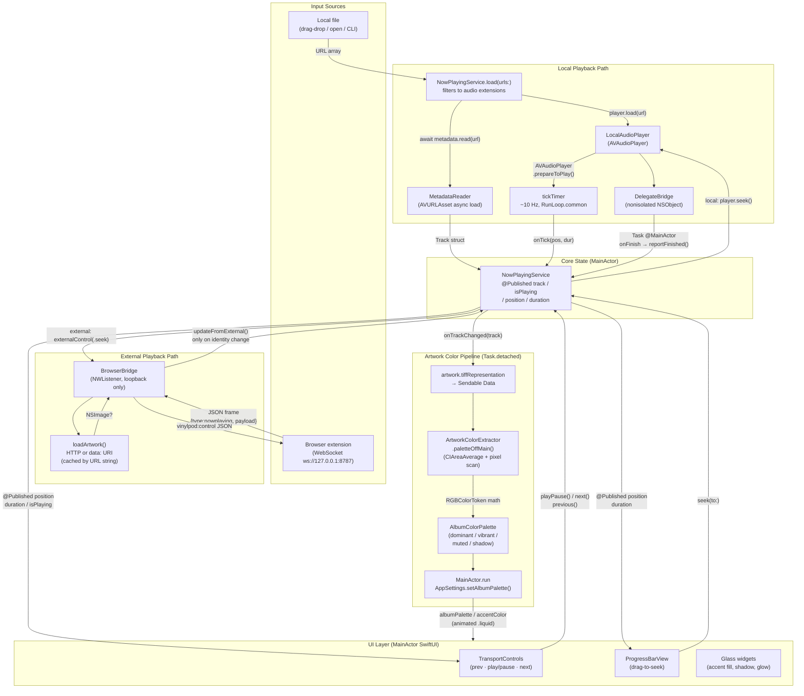

# 04 — Audio, Metadata, and Artwork Color Pipeline

## Overview

VinylPod exposes a unified "now-playing" surface that can be fed by two mutually exclusive input paths:

1. **Local-file playback** — the user drops or opens an audio file; VinylPod owns the audio engine and all transport state.
2. **External/browser playback** — the "VinylPod Connect" browser extension monitors the active web tab (Spotify Web, Apple Music, YouTube Music, or any MediaSession-speaking page) and streams now-playing metadata over a loopback WebSocket; VinylPod relays transport commands back to the extension.

Both paths converge on a single `@MainActor` `NowPlayingService` observable that drives every view layer — the floating widget, the menu-bar popover, and the desktop widget.

The artwork color pipeline sits downstream of both paths. Whenever the track identity changes, `NowPlayingService` fires `onTrackChanged`. `AppDelegate` responds by snapshotting the artwork to `Data`, dispatching a `Task.detached` to extract a four-color `AlbumColorPalette` off the main actor using CoreImage, then hopping back to `@MainActor` to publish the palette into `AppSettings`. Every glass surface, the progress bar fill, and the play-button tint all derive their color from that palette.

---

## Architecture Diagram



---

## Key Types

### `Track` (`Sources/VinylPod/Core/Models.swift`)

```swift
struct Track: Equatable {
    var title: String
    var artist: String
    var album: String
    var artwork: NSImage?
    var duration: TimeInterval
    var source: PlaybackSource   // .localFile / .browser / .spotify / .appleMusic / .none
    var url: URL?
}
```

`Equatable` is implemented manually: only `title + artist + album + url + source` are compared. `artwork` and `duration` are intentionally excluded from identity. This is load-bearing — `NowPlayingService.updateFromExternal` guards all expensive side-effects behind `t != track`, and the progress position updates on every ~1 Hz external tick without triggering a re-render of the entire glass surface.

### `PlaybackSource` (`Models.swift`)

An enum with five cases: `.localFile`, `.browser`, `.spotify`, `.appleMusic`, `.none`. Every transport decision in `NowPlayingService` branches on `.localFile` vs anything-else; there is no separate branch per external source.

### `AudioPlaying` / `MetadataReading` / `ArtworkColorExtracting` (`Services.swift`)

Protocol seams injected by `AppDelegate` at startup. All three are `@MainActor`-constrained so implementations can freely access `@Published` properties. Dependency injection rather than direct instantiation means these could be replaced with mocks for testing without touching `NowPlayingService`.

### `LocalAudioPlayer` (`Audio/LocalAudioPlayer.swift`)

`AVAudioPlayer`-backed, `@MainActor final class`. Key design detail: AVFoundation delivers `AVAudioPlayerDelegate` callbacks on a **non-isolated** context. The inner `DelegateBridge` — a separate, non-isolated `NSObject` — receives the callback and hops to the main actor via `Task { @MainActor in }` before calling back to the owner. This sidesteps a Swift 6 isolation violation without resorting to `nonisolated(unsafe)`.

The tick timer runs at 0.1 s intervals added to `RunLoop.main` with mode `.common` so it keeps firing while the user drags the seek knob (which otherwise blocks the default run-loop mode). The timer fires on the main run loop but wraps its body in `Task { @MainActor }` to satisfy strict Swift 6 concurrency checking.

### `MetadataReader` (`Audio/MetadataReader.swift`)

Uses the modern `async/await` AVAsset loading API (`asset.load(.commonMetadata)`), available since macOS 12. Duration and common-metadata are loaded in **separate** `do/catch` blocks so a corrupt ID3 tag doesn't also lose the duration (which `AVAudioPlayer` can report separately at playback time). Title falls back to the filename stem; every other field falls back to empty string. Artwork is decoded from raw byte data (`dataValue` load) into `NSImage`.

### `ArtworkColorExtractor` (`Audio/ArtworkColorExtractor.swift`)

The class is `@MainActor` (protocol constraint), but the heavy work is in two `nonisolated static` methods called safely from a `Task.detached`:

- **`areaAverage`** — applies `CIAreaAverage` over the full image extent, reducing the image to a single RGBA pixel rendered into a 4-byte buffer. This gives the stable "mood" dominant color.
- **`samplePalette`** — downscales the image to ≤52×52 px, iterates every pixel in a tight loop, and accumulates two weighted sums: `vibrantWeight` (saturation^1.65 × brightness^0.72 × midtone bias) and `mutedWeight` (saturation near 0.30, brightness near 0.50). Pixels outside brightness [0.04, 0.98] or with low alpha are skipped.

After sampling, post-processing applies:
- Chroma check (`hasUsefulChroma`): if average saturation < 0.10 and vibrant weight < 3.5 %, the image is considered greyscale/monochrome and all saturation boosts are suppressed.
- `adjusted(saturation:brightness:maximumBrightness:)`: floor lifts and ceiling clamps run in HSB space via `NSColor`, ensuring colors are always displayable and readable over glass.
- `mixed(with:amount:)`: linear interpolation in linear RGB to blend dominant toward vibrant by 24 % (or 0 % for monochrome).

The returned `AlbumColorPalette` carries four `RGBColorToken`s — `Sendable` structs of plain `Double` triples, safe to cross task boundaries.

### `AlbumColorPalette` / `RGBColorToken` (`Core/Theme.swift`)

`RGBColorToken` is a `Sendable` struct (plain Double values, no object references) that adds helpers: `chroma`, `relativeLuminance` (WCAG 2.1 formula), `adjusted(saturation:brightness:maximumBrightness:)`, `darkened(_:)`, and `mixed(with:amount:)`. `AlbumColorPalette` is also `Sendable` and `Equatable` (value semantics all the way down), which makes the `guard palette != albumPalette` identity check in `AppSettings` a simple `==` without custom comparators.

### `BrowserBridge` (`Bridge/BrowserBridge.swift`)

Not `@MainActor` — runs its own `DispatchQueue` (`com.vinylpod.browserbridge`) for `NWListener`. Inbound frames are decoded on that queue; the final `NowPlayingService.updateFromExternal()` call hops to `@MainActor` via `Task { @MainActor in }`. Artwork downloads use `URLSession.shared.dataTask` (background), caching by URL string to avoid re-downloading the same cover on every ~1 Hz tick.

### `NowPlayingService` (`Core/Services.swift`)

The single `@MainActor` `ObservableObject` that owns:
- `@Published` `track`, `isPlaying`, `position`, `duration`
- `queue: [URL]` + `index: Int` for local playback sequencing
- Closure hooks: `player` (AudioPlaying), `metadata` (MetadataReading), `onTrackChanged`, `externalControl`

The `previous()` implementation applies the "3-second rule": if `position > 3` seconds, it seeks to 0 rather than jumping to the prior queue item — matching the UX convention of Apple Music, Spotify, etc.

### `ProgressBarView` (`Views/ProgressBarView.swift`)

A drag-gesture seek bar. While `isDragging`, the bar shows a **local** `dragValue` preview instead of the live `nowPlaying.position`, so the knob tracks the finger smoothly without the service re-seeking on every pixel of drag. The seek is committed only on `.onEnded`, which calls `nowPlaying.seek(to:)` once.

### `TransportControls` (`Views/TransportControls.swift`)

Thin view: three buttons that call `nowPlaying.previous()`, `nowPlaying.playPause()`, and `nowPlaying.next()`. No local state. The play-button tint is `settings.accentColor` (which tracks the live `albumPalette.vibrant`).

---

## Drag-Drop Ingestion (`ModeContentView.swift`)

Every window mode registers `.onDrop(of: [.fileURL], ...)` on the root `ModeContentView` shell. Drop handling resolves `NSItemProvider` objects to `URL`s in a `DispatchGroup`, collecting results under an `NSLock`, then calls `AppEnvironment.shared.nowPlaying.load(urls:)` on `.main` via `group.notify`. `NowPlayingService.load` filters the list to known audio extensions (`mp3 m4a aac wav aiff aif flac alac caf`) before replacing the queue. The Finder "Open With" path (`application(_:open:)`) and the CLI argument path (`CommandLine.arguments`) both funnel through the same `load(urls:)` entry point.

---

## Sendable Handoff: Artwork → Color Extraction

The non-trivial concurrency pattern in the codebase is the artwork-to-palette bridge in `AppDelegate.applicationDidFinishLaunching`:

```
onTrackChanged callback (MainActor)
  ↓
snapshot: track.artwork?.tiffRepresentation  → Sendable Data
  ↓
Task.detached(priority: .userInitiated)        ← leaves MainActor
  ↓
NSImage(data: snapshot)                        ← safe: created inside task
ArtworkColorExtractor.paletteOffMain(from:)   ← nonisolated static
  ↓
await MainActor.run { settings.setAlbumPalette(from: palette) }
```

`NSImage` itself is not `Sendable`. The snapshot-to-Data step extracts a `Sendable` byte blob before the task boundary, then reconstructs the `NSImage` inside the detached context where no other actor can touch it. This pattern satisfies Swift 6 strict concurrency without any `@unchecked Sendable` or `nonisolated(unsafe)` escape hatches.

`AppSettings.setAlbumPalette` guards against no-op re-assignment with `guard palette != albumPalette` before the `withAnimation(VPTheme.liquid)` block. Without this guard, every external-source tick (which fires `onTrackChanged` if the track identity is new) would re-trigger the 1.05-second liquid animation every second — a 98%-CPU idle render loop that was a confirmed production bug (fixed in commit `bed0c39`).

---

## Design Decisions and Tradeoffs

### `AVAudioPlayer` over `AVAudioEngine` / `AVPlayer`
`AVAudioPlayer` exposes `currentTime` and `duration` as synchronous properties, making a simple 0.1-second timer the complete progress-tracking solution. `AVPlayer` requires `CMTime` / KVO / `addPeriodicTimeObserver` machinery. `AVAudioEngine` adds DSP graph complexity that the app does not need. The tradeoff is that `AVAudioPlayer` cannot stream from a URL — it requires a local file. This is acceptable because the entire local-file feature is for files already on disk; streaming is the browser extension's job.

### Single `NowPlayingService` with source-based branching
Rather than two separate services (one for local, one for external), all transport methods branch on `track.source == .localFile`. This keeps the view layer ignorant of input source, which is the right abstraction: a progress bar doesn't need to know whether it's seeking AVAudioPlayer or posting a WebSocket message. The cost is that `NowPlayingService` holds both `player` and `externalControl` — slightly wider responsibility than strict SRP.

### Pixel-scan palette extraction vs. system API (NSColorSampler / CGImageGetColorSpace)
The hand-rolled pixel scan gives tunable weights (midtone bias, dark-color lift, vibrant weight threshold) that an opaque system API would not expose. The cost is the implementation surface — the `samplePalette` function is the most complex code in the audio module. The image is downscaled to ≤52×52 px before scanning (≤2,704 pixels), so even on a slow CPU the work completes in under 5 ms and priority `.userInitiated` is appropriate.

### External-source transport as a closure relay, not a protocol
`externalControl: ((ExternalControlAction) -> Void)?` is a simple optional closure set by `AppDelegate` after `BrowserBridge` is constructed. This avoids a circular reference cycle (BrowserBridge → NowPlayingService → BrowserBridge) that a direct reference would create. The tradeoff is that the type system doesn't enforce that `externalControl` is always set when an external track is active — a nil `externalControl` with an external-source track silently drops transport commands.

### Artwork cache in BrowserBridge keyed by URL string
The browser extension pushes artwork as a URL string on every ~1 Hz now-playing tick. Caching by the raw URL string avoids re-downloading the same cover 60 times per minute. The cache is a single slot (last URL + last image), which is sufficient because only one track plays at a time. Cache invalidation is implicit: a new URL string misses and triggers a fresh download.

---

## Known Risks

| Risk | Severity | Notes |
|------|----------|-------|
| `AVAudioPlayer` not Sendable — must not cross actor boundary | Medium | Handled: the player is `@MainActor`-confined and the `DelegateBridge` pattern is the only cross-boundary path. If a future refactor lifts `LocalAudioPlayer` off the main actor, the entire delegate bridge must be revisited. |
| Tick timer continues if `onTick` is nil | Low | `tick()` calls `onTick?(...)` safely (optional call), so no crash, just wasted timer cycles if the closure is never set. |
| `handleDrop` uses `NSLock` on background thread | Low | The `DispatchGroup` callbacks from `NSItemProvider.loadObject` land on an unspecified queue; the lock is correct but not necessary if there is only one provider. Fine as-is. |
| `BrowserBridge.externalControl` optional — silent no-op | Low | If `AppDelegate` wiring order changes and `externalControl` is not set before the first external track arrives, transport commands silently drop. No assertion or log covers this. |
| CoreImage palette extraction allocates a new `CIContext` per call | Low-Medium | `CIContext` is documented as heavyweight. `paletteOffMain` creates a fresh context on each call. For the current usage pattern (one call per track change) this is fine; a repeated-call pattern (batch import) would benefit from a shared context. |
| Artwork cache not thread-safe across concurrent connections | Very Low | `BrowserBridge` currently allows up to 6 simultaneous connections that all call `loadArtwork` on the same `queue` serially. If this ever moves to a concurrent queue the cache write must be protected. |
| Single-slot artwork cache eviction has no fallback | Low | If `lastArtworkURL` matches but `lastArtworkImage` is nil (download failed), the nil image is cached. A retry on nil would recover automatically; currently the extension must send a different URL or reconnect to force a re-fetch. |

---

## Audio Extension Checklist for Future Work

- **Gapless playback**: the queue advances via `reportFinished → next → playCurrent`, which calls `player.load(url)` then `player.play()`. There is a small gap between tracks because `load` calls `prepareToPlay` synchronously but playback does not start until `play()` is called after the metadata `Task` completes. Gapless would require double-buffering with `AVAudioEngine`.
- **`FLAC` / `ALAC` coverage**: `NowPlayingService.isAudio` lists `flac` and `alac` as valid extensions, but `AVAudioPlayer` on macOS can play ALAC natively; FLAC support depends on the macOS version (added in macOS 11). A file-load failure path in `LocalAudioPlayer.load` currently emits `onTick?(0, 0)` and leaves `player = nil` — subsequent `play()` is silently a no-op. A user-visible error state or a skip-to-next behavior would be a UX improvement.
- **MediaSession / MPRIS integration**: there is no `MPRemoteCommandCenter` registration for local playback, so system-level media keys (F7/F8/F9 on non-Touch-Bar Macs, AirPods double-tap, etc.) do not control VinylPod local playback. The hotkey store (`ShortcutStore` / `HotKeyManager`) covers user-configurable Carbon hotkeys, but not the system media key channel.
