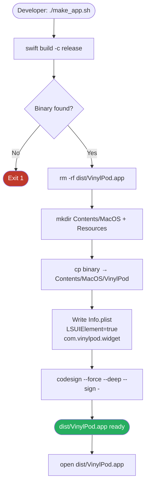

# VinylPod — Security, Performance, Persistence, Hotkeys & Build

> **Slice:** Cross-cutting concerns — the WebSocket bridge threat model, render-loop
> discipline, hotkey architecture, UserDefaults persistence, and the SPM → `.app`
> build pipeline. Read this before adding anything that touches `BrowserBridge`,
> `NowPlayingService`, `ShortcutStore`, `AppSettings`, or the build scripts.

---

## 1. Overview

VinylPod is an unsandboxed, menu-bar-only macOS app. Its attack surface is small
but non-zero: it runs a local WebSocket server (`BrowserBridge`) that the browser
extension connects to, and artwork URLs from the extension are attacker-influenced.
The app has no App Store sandbox entitlement, so there is no kernel-enforced
filesystem or network confinement — the hardening in `BrowserBridge.swift` is the
only layer between the extension payload and the rest of the system.

Performance discipline is equally load-bearing: `NowPlayingService.position` is
re-published every playback tick (10 Hz local, 1 Hz bridge). Any always-on parent
view that observes the full service via `@EnvironmentObject` will re-render at that
rate, which in profiling (`Instruments → Hangs / CPU`) traced to a 98% idle-CPU
loop before the fix. The rules in §3 encode why the isolation pattern is mandatory.

---

## 2. Security / Threat Model

### 2.1 Trust Boundary

```
Browser extension (UNTRUSTED)
        │  WebSocket on ws://127.0.0.1:8787
        ▼
BrowserBridge  ←── single point of ingestion for all external data
        │
        ▼
NowPlayingService  (Main Actor, trusted app state)
```

The browser extension is treated as **attacker-influenced input**. The extension
service-worker runs in the browser renderer process; any malicious web page that
can inject into the extension context (via XSS, manifest misconfiguration, or a
compromised extension update) can craft arbitrary `nowplaying` payloads. The app
itself never authenticates the extension.

Local audio files loaded by the user (`NowPlayingService.load(urls:)`) go through
a separate path — they never touch `BrowserBridge` and carry no attacker-controlled
fields.

### 2.2 Threat Model Table

| ID | Threat | Mitigation in code |
|----|--------|--------------------|
| T1 | **DoS via frame flooding** — extension hammers the server with large or rapid frames | `ws.maximumMessageSize = 256 * 1024` (NWProtocol option); `handle()` re-checks `data.count <= 256 * 1024` before decode |
| T2 | **Connection exhaustion** — hundreds of concurrent connections pile up unbounded | `accept()` caps at 6; oldest connection is evicted when the cap is hit |
| T3 | **SSRF via artwork URL** — payload supplies `artwork: "http://192.168.1.1/admin"` to reach a private host | ⚠️ **PARTIAL — bypassable, hardening pending.** `isPublicHost()` string-matches the literal host against loopback (`127.*`, `localhost`, `::1`, `0.0.0.0`), link-local (`169.254.*`), RFC-1918, `.local`/`.localhost`. It does **not** re-validate the resolved IP, HTTP redirect targets, or numeric/IPv6 IP encodings (`http://2130706433/`, `0x7f000001`, `[fe80::1]`, `[::ffff:127.0.0.1]`), so those bypass it. Impact is *blind* SSRF (response only decoded as an image, loopback-only). Tracked as HIGH-2 in the security backlog. |
| T4 | **Local file read via `file://` URL** — payload supplies `artwork: "file:///etc/passwd"` | `loadArtwork()` only proceeds if scheme is `http` or `https`; all other schemes are rejected before any fetch |
| T5 | **Memory exhaustion via huge image response** — server returns a multi-GB image body | `URLSession` response capped at `8 * 1024 * 1024` bytes; responses larger than 8 MB are silently discarded |
| T6 | **`data:` URI → `file://` dereference** — payload supplies a `data:` URI that could trick `URL(fileURLWithPath:)` | `decodeDataURI()` splits the string manually (no URL loading, no `Data(contentsOf:)`); only the payload after the comma is decoded as base64 or percent-encoding |
| T7 | **Title-field injection** — very long title string inflates `Track` struct in memory every tick | `title.count <= 2048` guard in `handle()`; null/empty titles are discarded (prevents clobbering a local track) |
| T8 | **Port exposure on 0.0.0.0** — server accidentally listens on all interfaces | `params.requiredLocalEndpoint = .hostPort(host: "127.0.0.1", port: 8787)` pins binding to loopback only |
| T9 | **Hung outbound fetch** — artwork fetch blocks a queue indefinitely | `req.timeoutInterval = 10` |
| T10 | **Race on artwork cache** — two concurrent frames both write `lastArtworkURL`/`lastArtworkImage` | Both reads and writes go through `self.queue` (the private serial `DispatchQueue`); the `URLSession` completion explicitly dispatches back to `queue.async` before writing |

### 2.3 What Is Explicitly NOT Defended

- **Extension authentication.** Any process on `127.0.0.1` that knows port `8787`
  can connect and push payloads. If a local malicious process does so it can
  overwrite the displayed track. Mitigation would require a shared secret or
  nonce, which the current architecture does not implement.
- **Rate-limiting beyond the 6-connection cap.** A single long-lived connection
  can still send frames at the maximum WebSocket frame rate; the only per-frame
  check is the size cap.
- **Origin header validation.** NWProtocolWebSocket in Network.framework does not
  surface an HTTP `Origin` header, so cross-origin WebSocket connections from a
  web page in the same browser are possible in principle. In practice, this attack
  requires the same user to visit a malicious page while VinylPod is running.
- **SSRF resolved-IP / redirect / encoding checks (T3).** The artwork-URL guard
  validates only the literal host string; it does not check the resolved IP, follow-up
  redirect targets, or numeric/IPv6 encodings. Blind, loopback-only, but real —
  tracked as HIGH-2 in the security backlog for the hardening pass.
- **Decoded-image dimension clamp.** The 8 MB response cap bounds encoded bytes,
  not decoded pixels; a decompression-bomb image could exhaust memory (MEDIUM-1).

---

## 3. Performance Invariants — Render-Loop Discipline

These are **rules**, not suggestions. Violating them has historically caused a
self-sustaining 98% idle-CPU loop and was caught only by `sample`/Instruments.

### Root Cause (recorded for context)

`NowPlayingService.position` is `@Published`. The bridge calls
`updateFromExternal(…)` once per second; local audio calls `reportTick` ~10
times per second. Both unconditionally assign `position = pos`.

Any SwiftUI view body that holds `@EnvironmentObject var nowPlaying: NowPlayingService`
will re-run its `body` on every assignment to any `@Published` property on that
object, including `position`. Before the fix, both `MenuBarContentView` (always
visible) and `DynamicIslandWidget` (always on-screen when notch is enabled)
observed the full service. The result was:

- `position` tick → `@EnvironmentObject` invalidation → full `body` re-diff of
  `MenuBarContentView` (which contains a `Picker/ForEach`) every second →
  `MainMenuItemHost.requestUpdate → ForEachState.update` churn.
- Same path in `DynamicIslandWidget` → `GraphHost.updatePreferences` loop.

At 10 Hz both loops compounded into continuous 60 fps re-renders even at idle.

### The Fix (what the code now does)

1. **`NowPlayingService.updateFromExternal` is change-gated on all fields except
   `position`.** Track identity, `isPlaying`, and `duration` are only assigned if
   they actually changed. Only `position` is written unconditionally, which is
   correct (it legitimately changes every tick).

2. **Parent shells do NOT observe `NowPlayingService` directly.**
   `MenuBarContentView` and `DynamicIslandWidget` declare only
   `@EnvironmentObject var settings: AppSettings`. The `NowPlayingService` is
   passed down to a *child* (`NowPlayingMenuSection`, etc.) that uses
   `@EnvironmentObject var nowPlaying: NowPlayingService`.

3. **Leaf views that show position coarsen to whole seconds** (integer cast or
   `Int(position)`) before comparing or displaying, so a 0.1-second tick that
   stays within the same second does not produce visible change.

4. **`AppSettings.setAlbumPalette(from:)` guards against palette re-assignment.**
   Before the fix, palette extraction ran on every `onTrackChanged` call, and
   the track was being re-assigned every bridge tick (because identity was not
   gated). Now palette extraction fires only when `trackChanged` is true, and
   `setAlbumPalette` adds a second guard (`palette != albumPalette`) to skip the
   `withAnimation` block for equal palettes.

### Mandatory Rules for Future Code

**Rule 1 — Never observe `NowPlayingService` in an always-on parent view.**
Any view that is structurally alive for the app's lifetime (menu-bar popover root,
dynamic island root, `WindowManager`'s hosting controller root) MUST NOT hold
`@EnvironmentObject var nowPlaying: NowPlayingService`. Push `nowPlaying`
observation down to leaf views that actually display playback data.

**Rule 2 — `position` must remain the only unconditionally-written field.**
All other fields on `NowPlayingService` must be guarded with an equality check
before assignment. If a new field must update every tick, it must follow the
whole-second coarsening pattern in its display site (Rule 3).

**Rule 3 — Leaf views displaying position must coarsen to whole seconds.**
Display `Int(position)` or compare `Int(position) != Int(lastShown)` rather
than the raw `TimeInterval`. A progress bar that reflects sub-second position
is not perceivable and produces constant re-renders.

**Rule 4 — `setAlbumPalette` must be called only on real track changes.**
`onTrackChanged` fires from `updateFromExternal` only when `trackChanged` is
true. Do not call it from a position tick. The palette extraction task is
`userInitiated` priority and creates `NSImage` off-main; scheduling it at 1 Hz
saturates a CPU core.

**Rule 5 — Size-switch transitions must use `.transition(.opacity)` cross-fades,
not `.id(mode)` pinning.**
Assigning a per-mode `.id` forces SwiftUI to destroy and recreate the entire
subtree (landscape + glass blur NSViews + hosting view), which briefly renders
the outgoing layout at the incoming window size — visible stretch artifact.
The current `ModeContentView` uses `.animation(VPTheme.fade, value: mode)` on
`content` with an implicit cross-fade; keep it that way.

**Rule 6 — `modeTransitionInFlight` guard in `WindowManager.apply(mode:)` must
stay.**
Without it, rapid UI interactions (e.g., DynamicIslandWidget size picker clicked
quickly) can enqueue multiple mode transitions in the same run-loop tick, each
hosting the full glass tree. The guard drops duplicate in-flight transitions.

### Measured CPU Budget (Phase 0 UAT amendment, 2026-07-03)

The rules above are structural — they prohibit *self-sustaining* re-render loops,
not intentional animation work. The historical "~0.0% steady-playback CPU"
figure was a proxy for loop absence that predates the deliberately-shipped
visualizer animations (10 Hz `TimelineView` in `DesktopWidgetCanvas`, island
equalizer, spinning vinyl disc). Measured on the landed Phase 0 tree
(bridge-path UAT, 2026-07-03; corroborated by 00-01's local-playback profile):

- **Idle (no track): ~0.0%** — hard gate; any sustained idle CPU is a Rule 1–6
  violation and a regression.
- **Steady playback, widget visible & animating: ≤ 25%** (measured mean ~17.9%,
  max 24.3%) — the cost is the by-design animations; it must drop back to ~0.0%
  when playback stops or nothing animates.

Phase 1's perf-guard tests are the enforcement point for both budgets. If the
animation cost should be reduced instead (lower fps, pause when unfocused or
occluded, `EqualizerBars`/`VinylDiskView` active gating), treat that as a
deliberate product change — the structural rules do not require it.

---

## 4. Hotkeys

VinylPod uses two separate hotkey systems with different scope and permission requirements.

### 4.1 Carbon Global Hotkeys (`HotKeyManager`)

**File:** `Sources/VinylPod/Hotkeys/HotKeyManager.swift`

- Implemented via `RegisterEventHotKey` / `InstallEventHandler` (Carbon
  HIToolbox). Carbon hotkeys fire system-wide regardless of which app has focus,
  **without requiring Accessibility permission** (unlike `NSEvent` global monitors).
- A single `InstallEventHandler` callback dispatches to `DispatchQueue.main.async`
  and then calls `fire(_:)`, which looks up the action by `EventHotKeyID.id` and
  invokes `onAction`.
- `HotKeyManager.reload(from:)` drops all current registrations and re-registers
  from `ShortcutStore`. This is called at startup and every time a binding changes
  (via `ShortcutStore.onChange`).
- Registration conflicts (hotkey already claimed by system or another app) are
  silently skipped — the UI still displays the binding; only the hardware event
  won't fire.
- The signature OSType is `0x56504B59` ("VPKY") to avoid collisions with other
  app hotkey registrations.

**Supported actions via global hotkeys** (user-recordable in Keyboard Shortcuts window):

| Action | Description |
|--------|-------------|
| `playPause` | Toggle play/pause on current source |
| `nextTrack` | Next track (local queue or browser extension) |
| `previousTrack` | Previous / restart if >3 s in |
| `openPlayer` | Show and focus the main window |
| `widgetSize` | Cycle to next `WindowMode` |
| `displayFullscreen` | Switch to `.desktopWidget` |
| `windowTopBottom` | Toggle desktop layer front ↔ back |
| `toggleNotch` | Enable/disable dynamic island panel |
| `toggleMenuBar` | Show/hide menu-bar item |
| `togglePopover` | *(reserved, no-op)* |

### 4.2 Local `NSEvent` Monitor — ⌘1–⌘5 Mode Shortcuts

**File:** `Sources/VinylPod/App/VinylPodApp.swift`, `installModeShortcuts()`

- Installed via `NSEvent.addLocalMonitorForEvents(matching: .keyDown)`.
- Fires only when VinylPod has key focus (menu-bar panel or `WindowManager` panel
  is front). This is intentional: these are window-management shortcuts, not
  system-wide media controls, and they do not require Accessibility permission.
- Maps ⌘1…⌘5 to `WindowMode.allCases` in order; any `WindowMode` that defines
  `shortcutKey` participates. Unknown characters pass through (`return event`);
  matched events are consumed (`return nil`).
- The monitor is removed in `applicationWillTerminate` to avoid a dangling
  monitor leak.

### 4.3 `ShortcutStore` Persistence

**File:** `Sources/VinylPod/Core/Shortcuts.swift`

- Stores `[ShortcutAction: KeyCombo]` encoded as a JSON dictionary keyed by
  `ShortcutAction.rawValue` (a `String`).
- Persisted under `UserDefaults` key `"keyboardShortcuts"` as `Data`.
- `KeyCombo` encodes: `keyCode` (Carbon virtual key code, `UInt32`), `carbonModifiers`
  (bitmask of `cmdKey | shiftKey | optionKey | controlKey`, `UInt32`), `display`
  (human-readable string, e.g. `"⌘⇧P"`).
- On load, unknown raw keys in the stored JSON are silently dropped (forward-compat
  safety for removed actions).

---

## 5. Persistence (UserDefaults Keys)

All persistence uses the standard `UserDefaults.standard` suite (no custom app group).

| Key | Type | Default | Description |
|-----|------|---------|-------------|
| `windowMode` | `String` (raw value of `WindowMode`) | `"small"` | Last-used window size; restored at launch |
| `desktopLayer` | `String` (raw value of `DesktopLayer`) | `"front"` | Desktop widget z-order (above/below desktop icons) |
| `useAdaptiveAccent` | `Bool` | `true` | Whether album art drives the accent/palette |
| `customBackgroundURL` | `URL` | `nil` | User-selected custom background image |
| `musicSource` | `String` (raw value of `PlaybackSource`) | `"spotify"` | Soft preference in the source picker (no longer a hard drop gate) |
| `vinylStyle` | `String` (raw value of `VinylStyle`) | `"image"` | Spinning vinyl render style |
| `showProgress` | `Bool` | `true` | Show progress bar in widget |
| `keepWindowInFront` | `Bool` | `true` | Float window above other apps |
| `dynamicNotch` | `Bool` | `true` | Show dynamic island panel |
| `showInMenuBar` | `Bool` | `true` | Show menu-bar icon |
| `launchAtLogin` | `Bool` | `false` | SMAppService launch-at-login registration |
| `showArtworkInDock` | `Bool` | `false` | Replace Dock icon with album art |
| `hideDockIcon` | `Bool` | `true` | `.accessory` activation policy (no Dock entry) |
| `coverArtAsWallpaper` | `Bool` | `false` | Set album art as desktop wallpaper |
| `hideNotchInFullscreen` | `Bool` | `false` | Future behavior hook (not yet implemented) |
| `keyboardShortcuts` | `Data` (JSON) | `{}` | `ShortcutStore` — see §4.3 |
| `vinylWindowOrigin` | Implicit (via `NSWindow` save/restore) | centred | Last window position on screen |

All boolean keys are read with an explicit `object(forKey:) as? Bool ?? default`
pattern so that missing keys (first launch) correctly fall back to the in-code
default, not `false`.

---

## 6. Build & Distribution Pipeline

### 6.1 Source Layout

```
VinylPodMac/
├── Package.swift          ← SPM manifest (single executableTarget)
├── make_app.sh            ← bundles binary → dist/VinylPod.app
├── Sources/VinylPod/      ← all Swift source
│   └── Resources/         ← bundled assets (.process() rule)
├── dist/                  ← generated; gitignored
│   └── VinylPod.app/
└── BrowserExtension/      ← separate Safari/Chrome extension (not part of SPM)
```

**`Package.swift`** declares:
- `swift-tools-version: 5.9`
- Platform: `macOS(.v13)` (Ventura minimum)
- A single `executableTarget` named `VinylPod` with a `.process("Resources")` rule
  so asset catalogs and bundled files are copied into the built product.
- No external SPM dependencies — all Apple frameworks are linked implicitly via
  import statements (`AppKit`, `Carbon`, `Network`, `AVFoundation`, etc.).

### 6.2 Build Pipeline



### 6.3 `make_app.sh` Step-by-Step

1. **`swift build -c release`** — compiles the SPM target; output filtered to drop
   linker warnings and search-path noise.
2. **Binary path discovery** via `swift build -c release --show-bin-path` — avoids
   hardcoding the DerivedData-style path, which varies by Xcode/CLT version.
3. **App bundle assembly** — creates `Contents/MacOS/` and `Contents/Resources/`
   directories, copies the binary in.
4. **`Info.plist` generation** (here-doc) — sets `LSUIElement = true` (no Dock
   icon at OS level), `NSHighResolutionCapable = true`, `LSMinimumSystemVersion =
   13.0`. Bundle identifier is `com.vinylpod.widget`.
5. **Ad-hoc codesign** (`--sign -`) — required for macOS Gatekeeper to allow local
   launch even without a Developer ID. Errors are suppressed with `2>/dev/null`
   and fall through gracefully (`|| echo "(codesign skipped)"`).
6. **Output:** `dist/VinylPod.app`. Run with `open dist/VinylPod.app`.

Debug builds: `./make_app.sh debug`. The debug binary path differs but `--show-bin-path`
handles it automatically.

### 6.4 Off-Desktop Build Path Requirement

**Do not clone the repo into `~/Desktop/` on a machine with iCloud Desktop sync enabled.**

When iCloud Drive syncs `~/Desktop`, it installs quarantine extended attributes
(`com.apple.quarantine`, `com.apple.metadata:*`) on files as they change. `codesign`
fails or produces invalid signatures when xattrs are present on the binary or bundle
during signing, because the signature covers the file content and selected xattrs.
This surfaces as Gatekeeper rejecting the app with "damaged" or as a non-zero
`codesign` exit code that the script silently swallows.

**Recommended path:** `~/Developer/VinylPodMac` or any non-iCloud-synced directory.

---

## 7. Known Risks

| Risk | Severity | Notes |
|------|----------|-------|
| No extension authentication | Medium | Any local process can push arbitrary track data to port 8787. Severity is low in practice (local user already has full system access), but a shared-secret handshake would harden it. |
| Unsandboxed `NSWorkspace.setDesktopImageURL` | Low | The wallpaper feature writes PNGs to `FileManager.temporaryDirectory` and sets them as wallpaper; no entitlement or user prompt is shown. PNGs are not attacker-controlled because artwork passes through `NSBitmapImageRep(data:)` decode first. |
| `launchAtLogin` silently fails if CLT-only binary | Low | `SMAppService.mainApp.register()` requires the bundle identifier to match a registered Login Item; the ad-hoc-signed `com.vinylpod.widget` bundle should work locally, but MAS or notarization would require a Developer ID and entitlements. |
| No codesign verification gate in `make_app.sh` | Low | A failed `codesign` is swallowed (`|| echo`). On production distribution, the script should `set -e` around codesign or explicitly check the exit code. |
| Temp PNG files accumulate during wallpaper cycles | Low | Each `applyArtworkToWallpaper()` call writes a new UUID-named PNG to `FileManager.temporaryDirectory` without deleting the previous one. macOS will eventually purge temp files, but high-churn usage (frequent track changes with `coverArtAsWallpaper` on) may fill the temp directory faster than expected. |
