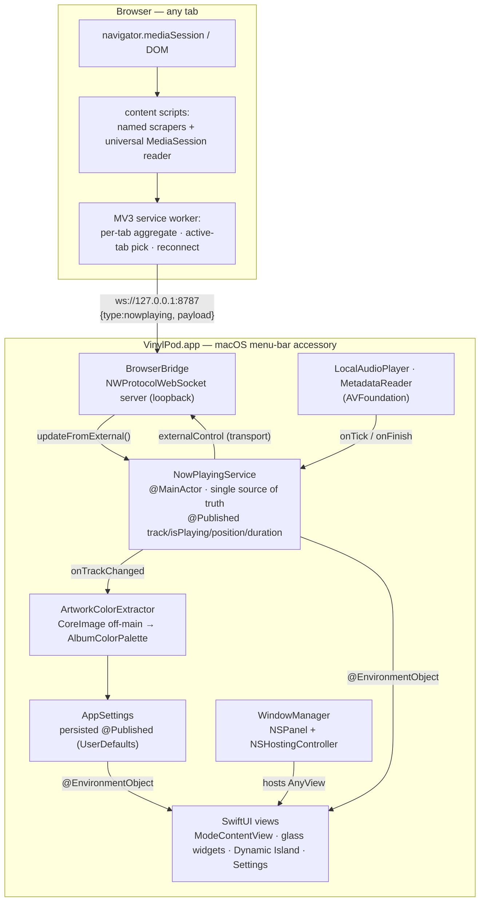

# VinylPod — System Design

VinylPod is a **free, macOS menu-bar (accessory) app** that shows what's playing —
from the **browser** (Spotify Web, Apple Music Web, YouTube, YouTube Music, or
*any* site via the MediaSession API) and from **local audio files** — as a
liquid-glass now-playing widget in five selectable sizes, plus an optional
macOS-style Dynamic Island. Built with **Swift Package Manager** (SwiftUI +
AppKit), no third-party dependencies.

This folder documents the product and architecture across eight slices. Start
here, then dive into the section you care about.

| # | Doc | Covers |
|---|-----|--------|
| 00 | [Product vision & target user](00-product-vision.md) | What VinylPod is, who it's for, value proposition, competitive positioning |
| 01 | [Core architecture](01-core-architecture.md) | Module layout, DI seams, `NowPlayingService` / `AppSettings` state core, Settings-window vs. dropdown, native-capture wiring |
| 02 | [Windowing & UI](02-windowing-and-ui.md) | `NSPanel`/`NSHostingController` hosting, the 5 window modes, size-switch rendering strategy, Dynamic Island |
| 03 | [Capture & bridge](03-capture-and-bridge.md) | Browser-extension capture pipeline, WebSocket wire protocol, native MediaRemote capture, Last.fm scrobbling |
| 04 | [Audio & media](04-audio-and-media.md) | Local playback (AVFoundation), metadata, off-main CoreImage color extraction |
| 05 | [Security, performance & build](05-security-performance-build.md) | Bridge threat model, render-loop invariants, hotkeys, persistence, build pipeline |
| 06 | [Design system](06-design-system.md) | Color tokens, the liquid-glass rendering recipe, typography/motion, per-size visual treatment |
| 07 | [Feature inventory](07-feature-inventory.md) | Every setting/control census — working vs. experimental vs. inert vs. placeholder |

## System overview

**One-paragraph data flow:** A browser tab's now-playing state is read by a
content script (named-site scraper or the universal MediaSession reader),
aggregated per-tab in the MV3 service worker, and streamed over a loopback
WebSocket to `BrowserBridge`, which validates/hardens it and calls
`NowPlayingService.updateFromExternal(...)` on the main actor. Local files take a
parallel path through `LocalAudioPlayer`. `NowPlayingService` is the single
source of truth; a real track change triggers off-main CoreImage color extraction
into an `AlbumColorPalette` that drives the liquid-glass surfaces. SwiftUI views
observe the service and settings via `@EnvironmentObject`; `WindowManager` hosts
them in a reusable `NSPanel`. Transport commands flow back out through the same
WebSocket to control the web player.

## Key design decisions

- **Browser extension over a private API.** Competitors capture now-playing via
  Apple's private `MediaRemote.framework` — which Apple restricted in macOS 15.4
  and which blocks Mac App Store distribution. VinylPod's extension + localhost
  WebSocket is App-Store-safe, cross-browser, and unaffected by that lockdown.
  Trade-off: an extension install is required, and only *browser* playback is
  seen (not the native Spotify/Apple Music desktop apps).
- **One state core, two input paths.** `NowPlayingService` unifies local-file and
  external/browser sources behind `track.source`; transport routes to the local
  player or the `externalControl` relay accordingly.
- **Reuse the window, swap the content.** A single `NSPanel` + `NSHostingController`
  is reused across size switches (only widget⇄non-widget recreates it); the
  visual change is an opacity cross-fade under a stable `.id` so the expensive
  `NSVisualEffectView` blur layers are never torn down.
- **Loopback-only, hardened bridge.** 127.0.0.1 bind, 256 KB frame cap, 6-connection
  cap, SSRF guard + `data:`-string decode on artwork, 8 MB image cap, serial-queue
  state confinement. See doc 05 for the full threat model.

## Performance invariants (must-keep rules)

These come from the ~85% CPU render-loop incident (fixed; verified idle **and**
during playback at **0.0% CPU**). Future code must preserve them:

1. **Never observe `NowPlayingService` wholesale in an always-on parent view.**
   `position` is `@Published` and rewritten every tick — observing it high in the
   tree re-renders everything (incl. the `WindowMode` `ForEach`) every tick.
2. **Read `position` only in dedicated leaf views, coarsened to whole seconds.**
3. **Guard every `@Published` write on equality** (except `position`) before
   assigning, so unchanged data doesn't fire `objectWillChange`.
4. **Never re-extract / re-assign the album palette from a tick** — dedupe equal
   palettes (`palette != albumPalette`).
5. **Size switches use an opacity cross-fade under a stable `.id`,** not a
   per-mode `.id(mode)` (which tears down and rebuilds the glass layers).

## Competitive context & roadmap signals

From a survey of 12+ now-playing apps (Sleeve, Tuneful, NepTunes, Vinyls, Silicio,
Jukebox, and the notch tier — NotchNook, DynamicLake, Alcove, BoringNotch,
MediaMate):

- **Differentiation:** free, App-Store-safe browser/MediaSession capture, 5
  selectable widget sizes, liquid-glass + adaptive palette. No competitor combines
  these.
- **Both former gaps are now closed, experimentally.** Last.fm scrobbling
  (`Sources/VinylPod/Scrobbling/`) and an optional native MediaRemote capture
  path (`Sources/VinylPod/Capture/NativeMediaRemoteCapture.swift`, dlopen/dlsym-
  based so it degrades gracefully if Apple further gates the private framework)
  were both added tonight — see doc 03. **Known issue:** per doc 07's feature
  inventory, the Settings-window tab that should expose native capture + Last.fm
  currently renders stub placeholders instead of the real (fully implemented)
  sections — a stale "does not exist yet" comment in `SettingsWindow.swift`
  never got updated after those sections were built. Small fix, currently blocks
  users from discovering either feature.
- **Crowded arena:** the Dynamic Island feature competes with mature, feature-rich
  notch apps (File Tray, calendar, HUD). VinylPod's island is now-playing-only —
  fine as a complement, not a differentiator.
